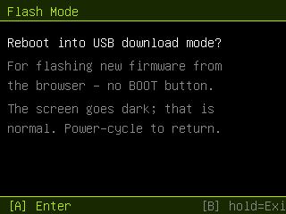

# MeowKit‑S3 Custom Firmware — "MeowGotchi" build

Custom, community firmware for the **MeowKit‑S3** (ESP32‑S3) pocket multi‑tool.
It fixes the boot bugs that stop the open‑source firmware from running on retail
hardware, repairs several half‑finished stock UI elements, and fills the empty
app slots with working WiFi/BLE security tools.

> ## ⚠️ Experimental / testing firmware — flash at your own risk
> This is **unofficial, experimental testing firmware**. You flash it to your
> device **entirely at your own risk**. It is provided **as‑is, with no warranty
> of any kind** — no guarantee of fitness, stability, or that it won't brick,
> misbehave, or void your warranty. **You are solely responsible** for anything
> that happens to your device. If in doubt, don't flash it.
>
> **Recovery:** the official installer at <https://meowkit.cc/pages/download>
> restores the factory firmware.

> ## 🔐 Authorized use only
> The WiFi/BLE tools here (sniffing, deauth, handshake capture, BLE/AP scanning)
> are for testing networks and devices **you own or are explicitly permitted to
> assess**, and for education. The detectors are passive (listen‑only).
> MeowGotchi's deauth and handshake capture are **off by default and opt‑in**.
> Using these against networks or people without permission may be illegal — you
> are responsible for complying with the laws in your jurisdiction.

---

## What this is

Based on the open‑source [`mingolucky/meowkit-s3-firmware`](https://github.com/mingolucky/meowkit-s3-firmware).
Built entirely in Docker (nothing installed on the host). Full technical guide:
**[`docs/CUSTOM-FIRMWARE.md`](docs/CUSTOM-FIRMWARE.md)**.

## Screenshots

Desktop‑simulator renders (mock data); on device these show live readings.

| | |
|:--:|:--:|
| **MeowGotchi** — WiFi hunter    | **WiFi Analyzer**    |
| **Deauth Detector**    | **Attacker Log** (who's attacking + RSSI)    |
| **BLE Spam Detector**    | **Rogue Radar** — Evil‑Twin scan    |
| **Rogue Radar** — Beacon Flood / Karma    | **Flash Mode** (no BOOT button)    |
| **Settings ▸ About** (the fixed info button)    | |

## Download & flash

Prebuilt image: **[`releases/meowgotchi-merged-0x0.bin`](releases/meowgotchi-merged-0x0.bin)**
(checksums in [`releases/SHA256SUMS.txt`](releases/SHA256SUMS.txt)).

1. Enter download mode — open the **Flash Mode** app and press **A**, or power
   off, hold **BOOT**, plug USB, hold ~3 s, release.
2. In a Web‑Serial flasher (Chrome/Edge, e.g. <https://esp.huhn.me>): **Connect**
   → add `meowgotchi-merged-0x0.bin` at offset **`0x0`** → **Program** →
   power‑cycle. (An "Erase Flash" first is safe.)

> The image is built **DIO** flash mode to match the hardware. A QIO build boots
> once then crash‑loops — see the changelog.

## Building it yourself

Docker only — see [`docs/CUSTOM-FIRMWARE.md` §3](docs/CUSTOM-FIRMWARE.md).

---

## Changelog — all changes vs. stock

### Boot / stability (makes it actually run on retail units — upstream issue #27)
- **DIO flash mode.** Stock built **QIO**; the hardware runs **DIO** (verified by
  diffing the factory image's bootloader header). QIO boots once then crash‑loops.
  → `board_build.flash_mode = dio` + `memory_type = dio_opi`; images merged as DIO.
- **Brownout / watchdog.** A current spike during the AXP173/I²C power bring‑up
  tripped the brownout detector → reset loop. → disabled at the first instruction
  in `setup()`.
- **Clean‑clone build restored** — `.gitmodules` was never committed (missing
  `mooncake.h`); pinned submodule URLs added back.

### UI / usability fixes
- WiFi long‑SSID rows truncate with `…` instead of wrapping out of the row.
- PC Monitor renders a real `°` (temperature font is ASCII‑only) and fixes a
  mislabeled block.
- Settings **info button** was dead (no handler) → now opens an **About** panel
  (firmware / SoC / MAC / free heap / SD), distinct from the settings button.

### New apps (previously empty slots 10–15)
| Slot | App | Summary |
|---|---|---|
| 10 | **MeowGotchi** | Pwnagotchi‑style cat‑face WiFi hunter: sniff, channel hop, AP/client discovery, WPA‑handshake capture to SD (`.pcap`), opt‑in deauth. |
| 11 | **WiFi Analyzer** | 2.4 GHz scan → AP list (channel/quality/lock) → per‑AP detail (BSSID, dBm+%, security). |
| 12 | **Flash Mode** | Reboots into USB download mode from software (`usb_persist_restart(RESTART_BOOTLOADER)`) — flash without the BOOT button. |
| 13 | **Deauth Detector** | Passive deauth/disassoc monitor (CLEAR/ALERT + 30 s graph) with an **Attacker Log** (source MAC, count, RSSI to locate the attacker). |
| 14 | **BLE Spam Detector** | Passive BLE scan for Apple/Google/MS/Samsung spam‑popup floods; alerts on distinct advertiser MACs/sec, per‑vector breakdown. |
| 15 | **Rogue Radar** | **Evil‑Twin** scan (open+secure same SSID) + **Beacon Flood / Karma** monitor (distinct APs/sec). |

Controls everywhere: **A** = action, **short B** = toggle/secondary,
**hold B** = exit.

### Tooling added
- Containerized PlatformIO build + a single merged flash‑at‑`0x0` image.
- Two headless desktop **simulators** (LVGL system screens + LovyanGFX app
  screens) so UI can be reviewed without hardware.

---

## Credits & license

Base firmware © `mingolucky` (MeowKit‑S3). The upstream repo ships **no LICENSE**
and links GPL‑3.0 code (`ESP32‑audioI2S`) and LGPL‑2.1 code (`IRremoteESP8266`),
so redistribution terms are governed by those — treat this fork accordingly.
LVGL desktop simulator adapted from upstream PR #31 (kdelfour). This fork's
changes are shared in the same spirit for the MeowKit community.
