# FeralCat — MeowKit‑S3 custom firmware (by FeralDevs)

[](https://discord.gg/BQkmxPj9Me)

💬 **Community & support:** [discord.gg/BQkmxPj9Me](https://discord.gg/BQkmxPj9Me)

**FeralCat v0.11.2** is the current build: adds an opt‑in **sleep mode** (idle or a
single power‑button press turns the screen off and light‑sleeps instead of powering
off — press any button, including power, to wake) and a **proximity radar** in
Tracker Detect. On top of signed **native ELF apps** loaded from
the SD card through a stable app SDK, the firmware updater as a system module,
a red UI theme, and the FeralCat rebrand — plus v0.9.0's Lua platform and
MP3 player. Six security tools (WiFi Analyzer, Deauth Detect, Rogue Radar, BLE
Spam Detect, Probe Sniffer, Tracker Detect) now ship as **signed SD apps** in
`sd files/apps`; copy them onto the card after flashing.

Custom, community firmware for the **MeowKit‑S3** (ESP32‑S3) pocket multi‑tool.
It fixes the boot bugs that stop the open‑source firmware from running on retail
hardware, repairs several half‑finished stock UI elements, and fills the empty
app slots with working WiFi/BLE security tools.

> ## ⚠️ Experimental / testing firmware — flash at your own risk
> This is **unofficial, experimental testing firmware**. You flash it to your
> device **entirely at your own risk**. It is provided **as‑is, with no warranty
> of any kind** — no guarantee of fitness, stability, or that it won't brick,
> misbehave, or void your warranty. **You are solely responsible** for anything
> that happens to your device. If in doubt, don't flash it.
>
> **Recovery:** the official installer at <https://meowkit.cc/pages/download>
> restores the factory firmware.

> ## 🔐 Authorized use only
> The WiFi/BLE tools here (sniffing, deauth, handshake capture, BLE/AP scanning)
> are for testing networks and devices **you own or are explicitly permitted to
> assess**, and for education. The detectors are passive (listen‑only).
> MeowGotchi's deauth and handshake capture are **off by default and opt‑in**.
> Using these against networks or people without permission may be illegal — you
> are responsible for complying with the laws in your jurisdiction.

---

## What this is

Based on the open‑source [`mingolucky/meowkit-s3-firmware`](https://github.com/mingolucky/meowkit-s3-firmware).
Built entirely in Docker (nothing installed on the host). Full technical guide:
**[`docs/CUSTOM-FIRMWARE.md`](docs/CUSTOM-FIRMWARE.md)**.

## Screenshots

<sub>Desktop‑simulator renders (mock data); on device these show live readings.</sub>

| | |
|:--:|:--:|
| **MeowGotchi** — WiFi hunter <br> 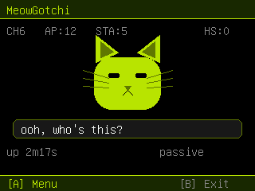 | **WiFi Analyzer** <br> 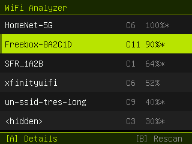 |
| **Deauth Detector** <br> 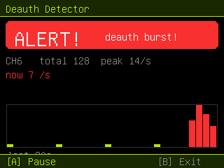 | **Attacker Log** (who's attacking + RSSI) <br> 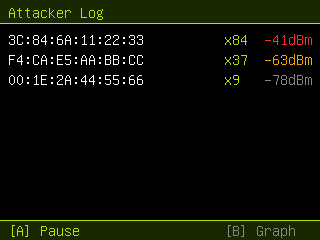 |
| **BLE Spam Detector** <br> 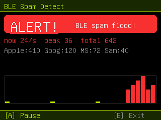 | **Rogue Radar** — Evil‑Twin scan <br> 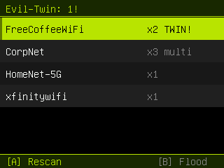 |
| **Rogue Radar** — Beacon Flood / Karma <br> 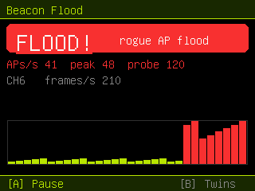 | **Firmware** — SD update / USB download <br>  |
| **SD firmware update** (no computer) <br>  | **Settings ▸ About** (the fixed info button) <br> 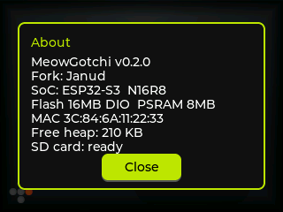 |
| **Update over WiFi** — checks GitHub for a newer release <br>  | **…then downloads it to the SD card** <br> 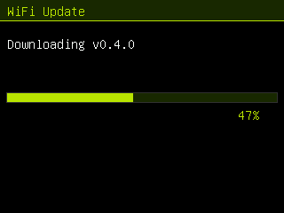 |
| **Probe Sniffer** — nearby devices + the SSIDs they leak <br> 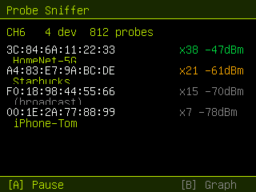 | **Tracker Detector** — AirTag/Tile/SmartTag "FOLLOWED!" <br> 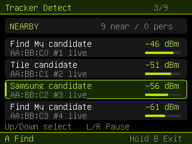 |
| **Firmware update in Settings** — SD / GitHub / USB <br> 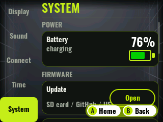 | **Settings ▸ Backup** — backup / restore, scrollable rail <br> 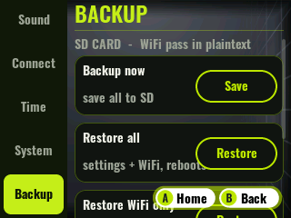 |
| **Script Runner** — run Berry `.be` scripts from the SD <br> 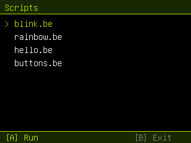 | |

## Download & flash

Two artifacts in [`releases/`](releases/) (checksums in
[`SHA256SUMS.txt`](releases/SHA256SUMS.txt)):
- **`feralcat-OTA-merged-0x0.bin`** — the complete image, flashed **once** over USB.
- **`firmware.bin`** — the app image used for **SD‑card updates** afterwards.

**First time (USB):**
1. Enter download mode — open **Firmware → USB Download Mode → A**, or power off,
   hold **BOOT**, plug USB, hold ~3 s, release.
2. Web‑Serial flasher (Chrome/Edge, e.g. <https://esp.huhn.me>): **Connect** →
   add `feralcat-OTA-merged-0x0.bin` at offset **`0x0`** → **Program** →
   power‑cycle. Do an **Erase Flash** first (it's a partition‑layout change).

**Updates after that — no computer:**
- **Over WiFi (easiest):** **Firmware → Update over WiFi → A**. It reconnects to
  the WiFi you saved in **Settings ▸ WiFi**, checks this repo's latest release,
  and if it's newer, downloads `firmware.bin` to the SD card and offers to flash
  it — all on‑device.
- **Manual SD:** copy `firmware.bin` to the SD‑card root as `firmware.bin` →
  **Firmware → Update from SD → A**.

Full guide: [`docs/SD-UPDATE.md`](docs/SD-UPDATE.md).

### 📂 SD‑card files (required for the apps)

The firmware image alone does **not** contain the native apps or their assets —
those live on the SD card. Copy the contents of [`sd files/`](sd%20files/) to the
**root of the SD card**, so you end up with:

```
SD root/
├─ apps/                     ← native signed apps (each: app.elf + app.elf.sig + manifest.ini)
│  ├─ wifianalyzer/          ← WiFi Analyzer
│  ├─ deauthdetect/          ← Deauth Detect
│  ├─ rogueradar/            ← Rogue Radar
│  ├─ blespamdetect/         ← BLE Spam Detect
│  ├─ probesniffer/          ← Probe Sniffer
│  └─ trackerdetect/         ← Tracker Detect
├─ scripts/                  ← Berry .be scripts (Script Runner)
├─ music/                   ← music for MeowPlayer
└─ firmware.bin              ← optional, for SD updates
```

- Each app is a **signed** `app.elf` + detached `app.elf.sig` + a `manifest.ini`
  (name + icon). Keep the three together — an app with a **missing or invalid
  signature won't run** unless you enable *Settings ▸ Features ▸ Allow unsigned
  apps*. The apps appear as tiles the first time you open the **Apps** menu.
- Building your own signed app? See [`tools/app_signing/`](tools/app_signing/)
  and [`sd files/apps/build_app.sh`](sd%20files/apps/build_app.sh).

> Built **DIO** flash mode to match the hardware (a QIO build boots once then
> crash‑loops). The flash uses a **dual‑OTA** layout (two ~7.9 MB app slots) so
> it can safely self‑update — a failed/interrupted write rolls back to the
> current firmware.

## Building it yourself

Docker only — see [`docs/CUSTOM-FIRMWARE.md` §3](docs/CUSTOM-FIRMWARE.md).

---

## Changelog — all changes vs. stock

### v0.11.2 — Tracker beep + touch nav + IR polish
- **Tracker Detect — proximity beep** — the radar now beeps faster/shorter as the
  selected tracker's signal gets stronger, so you can home in without watching the
  screen. Signal strength only, no distance. *(Updates the Tracker Detect SD app —
  re-copy `/apps`.)*
- **Touchscreen app navigation** — the apps menu is now navigable by touch, reusing
  the joystick navigation path.
- **Infrared** — refreshed app icon and added a "remove saved remote" action.
- Contributions by **Waren Gonzaga**.

### v0.11.1 — Fix: MeowPlayer finds no music
- **Fixed: "no music in /music"** — an incomplete `/mp3`→`/music` rename left the
  path validator rejecting every file in `/music`, so MeowPlayer found **no tracks**
  even when files were present. Music is detected again.
- **Infrared — save & replay remotes** — capture a remote and **save it into folders**
  on the SD card, with a folder picker, overwrite/delete confirmations, and a
  consistent red theme. Contributed by **Waren Gonzaga**.

### v0.11.0 — Sleep mode + Tracker radar
- **Sleep mode** (opt‑in, Settings ▸ Features) — when idle, or on a **single
  power‑button press**, the screen turns off and the device light‑sleeps instead of
  powering off; **press any button (including the power button) to wake** and resume
  exactly where you were. Works from the home screen and inside apps. On external
  power it stays in screen‑off standby. Powers off at ≤20% battery to protect the
  cell; a ~4 s long‑press still fully powers off.
- **Tracker Detect — proximity radar** — pick a tracker candidate from the list and
  follow its signal on a radar view (concentric strength rings + stronger/weaker
  trend + a history sparkline) to help you locate it. Relative signal strength only —
  no distance or bearing. Feature contributed by **Caliun**.

### v0.10.3 — Fix: update stuck on "Rebooting…"
- WiFi/SD firmware update now **auto‑reboots** into the new firmware instead of
  waiting for a button press (reported on Discord).

### v0.10.2 — MeowPlayer is a native signed app
- **MeowPlayer** now ships as a **signed native ELF app** on the SD card
  (now‑playing, Songs list, Speaker/Jack output, auto‑advance), driven through the
  app SDK's media API. Plays `.mp3` from the **`/music`** folder.

### v0.10.1 — FeralCat icons + fast boot
- New red **FeralCat app icons** for the six native apps and the MeowGotchi tile;
  each app now has its own icon.
- **Fast‑boot fix** — the SD `/apps` scan no longer runs at boot (it stalled the
  splash for a few seconds once several apps were installed); it's done lazily the
  first time the Apps menu is opened.

### v0.10.0 — FeralCat: native signed apps + rebrand
- **Native signed apps** — load, verify and run **signed native ELF apps** from
  the SD card through a stable app SDK, each with its own launcher tile. **Ed25519**
  signatures verified on‑device (Monocypher); unsigned apps are opt‑in via
  *Settings ▸ Features*. Offline signing tool in [`tools/app_signing/`](tools/app_signing/).
- Six security tools now ship as **signed SD apps**: WiFi Analyzer, Deauth Detect,
  Rogue Radar, BLE Spam Detect, Probe Sniffer, Tracker Detect.
- **FeralCat rebrand** — new name, **red UI theme**, new mascot.
- **Firmware updater** is now a system module at **Settings ▸ System ▸ Update**
  (no longer an app).

### v0.9.0 — MeowPlayer + Lua apps
- **MeowPlayer** — an MP3 music player (plays from `/music`; play/pause, seek,
  volume, Songs list, Speaker/Jack output) on a native audio engine.
- **Lua app platform** — opt‑in installable Lua apps from `/apps` with launcher
  tiles (*Settings ▸ Features ▸ Lua apps*, off by default).

### v0.8.1 — Keyboard symbols
- T9 keyboard gained the full ASCII symbol set (semicolon, brackets, etc.) across
  paged symbol screens.

### v0.8.0 — Meow XP (device‑wide leveling)
- **Meow XP** — a system‑wide XP/level system: earn XP for using the device and
  for finds; level shown on the home screen. Stored in NVS + mirrored to SD
  (checksum‑guarded), with Backup/Restore in Settings. Also fixed a navigation
  crash when scrolling screens.

### v0.7.0 — Script Runner (Berry) + lightweight boot splash
- **Script Runner** — run small **[Berry](https://berry-lang.github.io/)** scripts
  from `/scripts/*.be` on the SD card: pick one in the app and it runs, with
  `print()` output on screen. A tiny device API is exposed to scripts —
  `led(r,g,b)` (onboard WS2812), `pin_mode/write/read`, `button("A"…)`,
  `delay`, `millis`, `print`. A VM hook stops any script after ~20 s or when you
  **hold B**, so an infinite loop can't hang the device. See
  [`docs/SCRIPTING.md`](docs/SCRIPTING.md); examples in [`docs/scripts/`](docs/scripts).
  The Berry VM adds only ~120 KB.
- **Boot splash rewritten** — the old ~2 MB boot GIF (baked into the app image)
  is replaced by a small title + **progress bar tied to the real boot stages**.
  Frees **~1.6 MB** of the app slot (88.6% → 70.6% flash) and boots faster.

### v0.6.0 — Settings backup & restore (survive a reflash)
- **SD‑card settings backup.** Every setting — brightness, volume, LED, BLE, and
  **WiFi credentials** — is mirrored to `/config/meowkit.cfg` on the SD card on
  each change. After a full reflash wipes NVS, the settings are **auto‑restored
  from the card on boot**, so you don't lose your WiFi. *(The WiFi password is
  stored in plain text in that file, by design — anyone with the card can read
  it.)*
- **New Settings ▸ Backup tab** — **Backup now**, **Restore all**, **Restore
  WiFi only**, **Restore settings only**; each restore confirms, writes NVS, and
  reboots to apply cleanly.
- **Scrollable settings rail.** The settings tabs now live in a scrollable side
  rail (LVGL's built‑in tab bar can't scroll), so there's room for more sections
  without cramping.
- **Fix: unreadable (gray‑on‑gray) dialogs.** Message boxes (backup/restore
  confirmations, Factory Reset, Time Sync) had a styled background but no text
  color, so the text fell back to a dark default. All dialogs now use a shared
  style with a readable light title/body/buttons.

### v0.5.2 — Firmware update in Settings
- **Settings ▸ System ▸ Firmware ▸ Open** launches the Firmware app (SD‑card /
  GitHub‑WiFi / USB update) straight from Settings. It opens the app by name via
  the launcher, so it's reachable **even if the apps grid is unavailable** — a
  recovery path for the kind of menu problem v0.5.1 fixed.

### v0.5.1 — Fix: empty apps menu
- The apps menu is created once at boot **before** the app list is loaded, so the
  v0.5.0 menu‑rebuild left it empty on device. Tile building now also runs when
  the list loads (`build_tiles()` from both `screen_init` and `load_apps`).

### v0.5.0 — Two new detectors, on‑device screenshots, WiFi time sync
- **Tracker Detector** (app 17) — passively scans BLE for **AirTag / Find My,
  Tile, and Samsung SmartTag** item trackers and flags any that stay near you
  long enough to suggest you're being followed (`FOLLOWED!`). *Find My rotates
  its MAC ~every 15 min, so persistence timing is best‑effort, not forensic.*
- **Probe Sniffer** (app 16) — logs the 802.11 **probe‑request** frames nearby
  phones/laptops broadcast, showing each device's MAC, signal, and the network
  names it leaks.
- **On‑device screenshots** — hold the joystick **Up+Down** inside MeowGotchi or
  any detector to save the screen to `/screenshots/shot_NNNN.bmp` on the SD card.
  (Captures the LovyanGFX app screens via their off‑screen buffer; the panel has
  no read line so the LVGL system screens aren't captured on device.)
- **WiFi Time Sync** — **Settings ▸ Time ▸ Sync over WiFi**: NTP for UTC +
  IP‑geolocation for your timezone → sets the clock **and** the RTC, no manual
  timezone. The clock is also now restored from the RTC at boot, so it's correct
  offline after a reboot.
- **Apps menu rebuilt** — the grid is now generated from the live app list
  (scrolls for >15 apps), which fixes the stale tile labels (the WiFi/BLE apps
  had shown leftover "NFC / smarthome / webserial / aichat" names) and dropped
  four unused icon assets.

### v0.4.0 — Self‑update over WiFi
- **Firmware ▸ Update over WiFi.** The device reconnects to the WiFi saved in
  **Settings ▸ WiFi**, reads this repo's latest release tag (via GitHub's
  `releases/latest` redirect — no API token, no rate limit), and if it differs
  from the running build, downloads `firmware.bin` straight to the SD card and
  offers to flash it. The download lands in `firmware.bin.part` and is only
  promoted to `firmware.bin` after a complete, size‑checked transfer, so a
  dropped download never leaves a half‑written image for the flasher to pick up.
  TLS uses `setInsecure()` (no cert pinning); the OTA layer still verifies the
  image on flash and rolls back a bad write.

### Boot / stability (makes it actually run on retail units — upstream issue #27)
- **DIO flash mode.** Stock built **QIO**; the hardware runs **DIO** (verified by
  diffing the factory image's bootloader header). QIO boots once then crash‑loops.
  → `board_build.flash_mode = dio` + `memory_type = dio_opi`; images merged as DIO.
- **Brownout / watchdog.** A current spike during the AXP173/I²C power bring‑up
  tripped the brownout detector → reset loop. → disabled at the first instruction
  in `setup()`.
- **Clean‑clone build restored** — `.gitmodules` was never committed (missing
  `mooncake.h`); pinned submodule URLs added back.

### UI / usability fixes
- WiFi long‑SSID rows truncate with `…` instead of wrapping out of the row.
- PC Monitor renders a real `°` (temperature font is ASCII‑only) and fixes a
  mislabeled block.
- Settings **info button** was dead (no handler) → now opens an **About** panel
  (firmware / SoC / MAC / free heap / SD), distinct from the settings button.

### New apps (previously empty slots 10–15)
| Slot | App | Summary |
|---|---|---|
| 10 | **MeowGotchi** | Pwnagotchi‑style cat‑face WiFi hunter: sniff, channel hop, AP/client discovery, WPA‑handshake capture to SD (`.pcap`), opt‑in deauth. |
| 11 | **WiFi Analyzer** | 2.4 GHz scan → AP list (channel/quality/lock) → per‑AP detail (BSSID, dBm+%, security). |
| 12 | **Firmware** | **Update over WiFi** (checks this repo's latest GitHub release and downloads `firmware.bin` to the SD), update from an SD‑card `firmware.bin` (dual‑OTA, no computer), or reboot into USB download mode (`usb_persist_restart(RESTART_BOOTLOADER)`) — no BOOT button. |
| 13 | **Deauth Detector** | Passive deauth/disassoc monitor (CLEAR/ALERT + 30 s graph) with an **Attacker Log** (source MAC, count, RSSI to locate the attacker). |
| 14 | **BLE Spam Detector** | Passive BLE scan for Apple/Google/MS/Samsung spam‑popup floods; alerts on distinct advertiser MACs/sec, per‑vector breakdown. |
| 15 | **Rogue Radar** | **Evil‑Twin** scan (open+secure same SSID) + **Beacon Flood / Karma** monitor (distinct APs/sec). |
| 16 | **Probe Sniffer** | Passive 802.11 probe‑request log: which devices are nearby and the SSIDs they leak (MAC, signal, requested network); list ↔ rate graph. |
| 17 | **Tracker Detector** | Passive BLE scan for **AirTag/Find My, Tile, Samsung SmartTag**; lists each with proximity and how long it's been near you, alerting when one persists (`FOLLOWED!`). |

Controls everywhere: **A** = action, **short B** = toggle/secondary,
**hold B** = exit. In MeowGotchi and the detectors, **hold Up+Down** saves a
screenshot to the SD card.

### Tooling added
- Containerized PlatformIO build + a single merged flash‑at‑`0x0` image.
- Two headless desktop **simulators** (LVGL system screens + LovyanGFX app
  screens) so UI can be reviewed without hardware.

---

## Credits & license

Base firmware © `mingolucky` (MeowKit‑S3). The upstream repo ships **no LICENSE**
and links GPL‑3.0 code (`ESP32‑audioI2S`) and LGPL‑2.1 code (`IRremoteESP8266`),
so redistribution terms are governed by those — treat this fork accordingly.
LVGL desktop simulator adapted from upstream PR #31 (kdelfour). This fork's
changes are shared in the same spirit for the MeowKit community.
