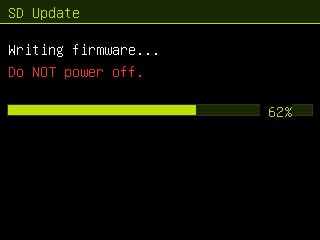

# SD‑card firmware updates (dual‑OTA) — `sd-ota` branch

This branch repartitions the flash into **two app slots** so the device can
update its own firmware from a `.bin` on the microSD card — no computer, no
BOOT button. It's a work‑in‑progress variant kept off `main`.

 

## How it works

The stock table has a single 12.5 MB app slot (no room to update safely). Here
the (unused) SPIFFS partition is dropped and the space split into two OTA slots
(`partitions_ota_16mb.csv`):

```
ota_0  0x010000  7.94 MB   ← runs from here
ota_1  0x800000  7.94 MB   ← update is written here, then booted
otadata 0x0e000            ← records which slot to boot
```

The **Firmware** app (app slot 12) offers:
- **Update from SD** — reads `/firmware.bin` from the card, streams it into the
  *spare* OTA slot via the Arduino `Update` API, sets it as the boot partition,
  and reboots. If anything fails or power is lost mid‑write, the current slot is
  untouched and still boots (safe rollback).
- **USB Download Mode** — same as before (reboot into the ROM bootloader).

The app is ~6.9 MB and each slot is ~7.94 MB → ~1 MB of headroom. If the
firmware grows past a slot, the OTA build will fail the size check.

## One‑time switch‑over (USB, required once)

Changing the partition table needs a full flash, so do this **once** over USB:

1. Enter download mode (Flash Mode app, or hold **BOOT**).
2. Flash **`releases/meowgotchi-OTA-merged-0x0.bin`** at offset **`0x0`**
   (Web‑Serial flasher; "Erase Flash" recommended for the layout change).

That lays down the dual‑OTA layout + firmware.

## Updating from SD afterwards

1. Copy **`releases/firmware.bin`** (the *app* image, not the merged `0x0` one)
   to the **root of the SD card**, named exactly **`firmware.bin`**.
2. Insert the card, open the **Firmware** app → **Update from SD** → **A**.
3. Watch the progress bar; it reboots into the new firmware when done.

> Use `firmware.bin` (the app partition image) for SD updates — **not** the
> `…-merged-0x0.bin` (that one is only for the USB switch‑over).

## Reverting to the single‑slot layout

Flash the `main` branch's `releases/meowgotchi-merged-0x0.bin` at `0x0` over USB
(erase first). That restores the non‑OTA partition table.
