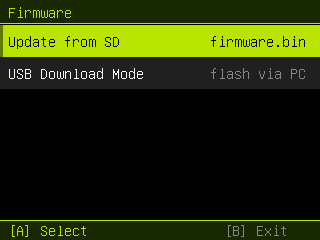
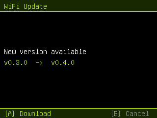

# Firmware updates (dual‑OTA): over WiFi or from SD

The flash is partitioned into **two app slots** so the device can update its own
firmware — no computer, no BOOT button. Updates can be pulled **over WiFi** from
this repo's GitHub releases, or flashed from a `firmware.bin` on the microSD card.

 

## How it works

The stock table has a single 12.5 MB app slot (no room to update safely). Here
the (unused) SPIFFS partition is dropped and the space split into two OTA slots
(`partitions_ota_16mb.csv`):

```
ota_0  0x010000  7.94 MB   ← runs from here
ota_1  0x800000  7.94 MB   ← update is written here, then booted
otadata 0x0e000            ← records which slot to boot
```

The **Firmware** app (app slot 12) offers:
- **Update over WiFi** — reconnects to the WiFi saved in **Settings ▸ WiFi**,
  checks this repo's latest GitHub release, and if the tag differs from the
  running build, downloads `firmware.bin` to the SD card, then hands off to the
  same OTA path below. (Details under *Updating over WiFi*.)
- **Update from SD** — reads `/firmware.bin` from the card, streams it into the
  *spare* OTA slot via the Arduino `Update` API, sets it as the boot partition,
  and reboots. If anything fails or power is lost mid‑write, the current slot is
  untouched and still boots (safe rollback).
- **USB Download Mode** — same as before (reboot into the ROM bootloader).

The app is ~6.9 MB and each slot is ~7.94 MB → ~1 MB of headroom. If the
firmware grows past a slot, the OTA build will fail the size check.

## One‑time switch‑over (USB, required once)

Changing the partition table needs a full flash, so do this **once** over USB:

1. Enter download mode (Flash Mode app, or hold **BOOT**).
2. Flash **`releases/feralcat-OTA-merged-0x0.bin`** at offset **`0x0`**
   (Web‑Serial flasher; "Erase Flash" recommended for the layout change).

That lays down the dual‑OTA layout + firmware.

## Updating from SD afterwards

1. Copy **`releases/firmware.bin`** (the *app* image, not the merged `0x0` one)
   to the **root of the SD card**, named exactly **`firmware.bin`**.
2. Insert the card, open the **Firmware** app → **Update from SD** → **A**.
3. Watch the progress bar; it reboots into the new firmware when done.

> Use `firmware.bin` (the app partition image) for SD updates — **not** the
> `…-merged-0x0.bin` (that one is only for the USB switch‑over).

## Updating over WiFi

Prerequisite: connect once in **Settings ▸ WiFi** (the SSID/password are saved
to NVS and reused by the updater).

1. Open the **Firmware** app → **Update over WiFi** → **A**.
2. It joins the saved network and reads the latest release tag from
   `github.com/FeralDevs/FeralCat/releases/latest` (via the redirect header —
   no API token, no rate limit). If it matches the running version you get
   *"Up to date"*; otherwise a *"vX → vY / Download"* prompt.
3. On **Download**, it streams `firmware.bin` to the SD card
   (`firmware.bin.part` → renamed to `firmware.bin` only on a complete,
   size‑checked transfer, so a dropped download never leaves a half‑file), then
   offers **"Flash it now?"** → the same dual‑OTA write as above.

Notes:
- A device must already be running a build that *has* this feature, so the first
  hop to it is still a manual SD or USB flash; after that it self‑updates.
- TLS uses `setInsecure()` (no certificate pinning). The transferred image is
  still validated by the OTA layer on flash, and a bad write rolls back.

## Reverting to the single‑slot / factory layout

Run the official installer at <https://meowkit.cc/pages/download> over USB — it
writes the factory image (single app slot) and restores stock behaviour.
