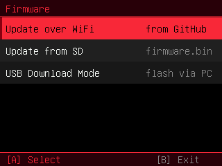

# Firmware Updates



> 🐱 **Custom** — built for this fork (not in the original firmware).

Once you're on this firmware you never need a computer to update again — the
device can pull a new build over WiFi or flash one from the SD card. Both use a
**dual-OTA** flash layout so a failed/interrupted write rolls back to the current
firmware instead of bricking.

Open the **Firmware** app (or **Settings ▸ System ▸ Firmware ▸ Open**). It offers
three options:

## Update over WiFi (from GitHub)

**Firmware → Update over WiFi → A.** It reconnects to the WiFi saved in
**Settings ▸ WiFi**, reads this repo's latest release tag via GitHub's
`releases/latest` redirect (no API token, no rate limit), and if it differs from
the running build, downloads `firmware.bin` to the SD card and offers to flash it.

- The download lands in `firmware.bin.part` and is only promoted to `firmware.bin`
  after a complete, size-checked transfer — a dropped download never leaves a
  half-file for the flasher.
- TLS uses `setInsecure()` (no cert pinning); the OTA layer still verifies the
  image on flash and rolls back a bad write.
- A device must already be running a build that *has* this feature, so the first
  hop is a manual SD/USB flash; after that it self-updates.

## Update from SD

Copy **`firmware.bin`** to the SD-card root, then **Firmware → Update from SD →
A**. It streams the image into the *spare* OTA slot, sets it as the boot
partition, and reboots. Use `firmware.bin` (the app image) — **not** the
`…-merged-0x0.bin`.

## USB Download Mode

**Firmware → USB Download Mode → A** reboots into the ROM serial bootloader
(`usb_persist_restart(RESTART_BOOTLOADER)`) — no BOOT button needed — so you can
flash from a computer. See **[[Flashing and Recovery]]**.

## Flash layout (dual-OTA)

```
nvs       0x009000  20 KB
otadata   0x00e000   8 KB   ← records which slot to boot
app0      0x010000  7.94 MB ← runs from here
app1      0x800000  7.94 MB ← an update is written here, then booted
coredump  0xFF0000  64 KB
```

The two app slots are why the app has ~7.94 MB (not 16 MB) to live in — the spare
copy is what makes self-update safe. A **one-time USB flash** of
`feralcat-OTA-merged-0x0.bin` at `0x0` installs this layout when coming from
stock.
