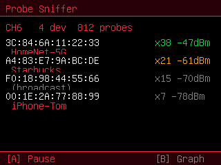

# Probe Sniffer

> 🐱 **Custom** — built for this fork (not in the original firmware).

Passively logs the **802.11 probe-request** frames that nearby phones and laptops
broadcast while searching for known networks — showing which devices are around
and the network names they leak.

## Controls
- **A** — pause / resume
- **short B** — device list ↔ rate graph
- **hold B** — exit

## Views
- **Device list:** each probing device's source MAC, hit count, signal, and the
  last SSID it asked for (or `(broadcast)` for wildcard probes).
- **Graph:** probe-requests per second, plus distinct-device and total counters.

Listen-only. Useful for presence detection and privacy awareness (many devices
leak the names of networks they've joined before).
