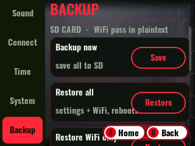

# SD Settings Backup & Restore

> 🐱 **Custom** — built for this fork (not in the original firmware).

Keeps your settings (and **WiFi credentials**) on the SD card so they **survive a
reflash**. Settings normally live in NVS (internal flash), which a full USB reflash
erases.

## How it works
Every setting change is mirrored to **`/config/meowkit.cfg`** on the SD card
(debounced so dragging a slider writes once). On boot, if NVS has **no saved WiFi**
(i.e. it was just erased), the whole backup is restored automatically — so you
don't have to re-enter WiFi after flashing.

## Manual backup / restore — Settings ▸ Backup tab
- **Backup now** — force-write the current settings to the SD.
- **Restore all** — settings + WiFi.
- **Restore WiFi only** — just the credentials.
- **Restore settings only** — everything except WiFi.

Each restore confirms, writes NVS, and **reboots** to apply cleanly.

## What's included
Brightness, auto-dim, volume, key tone, LED brightness/color/effect, Bluetooth
name/enable, WiFi SSID + password, WiFi enable.

> ⚠️ The **WiFi password is stored in plain text** in `/config/meowkit.cfg` (by
> design — the backup is portable and hand-editable). Anyone with the SD card can
> read it.
