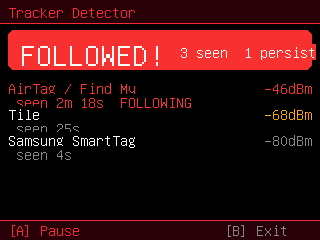

# Tracker Detector

> 🐱 **Custom** — built for this fork (not in the original firmware).

An **anti-stalking** BLE scanner: it looks for item-tracker candidates near you
and lets you home in on one with a proximity radar.

> Addresses rotate, so a row is an observation *candidate* within one scan
> session — **not** proof of a physical device or of being followed. Listen-only.

## Controls

**List view**
- **Up / Down** — select a candidate
- **A** — Find (open the proximity radar for the selected candidate)
- **Left / Right** — pause / resume scanning
- **hold B** — exit

**Radar view**
- **A** — pause / resume
- **tap B** — back to the list
- **hold B** — exit

## What it detects
Classifies BLE advertisements from:
- **Apple Find My / AirTag** (manufacturer 0x004C, Find-My type 0x12)
- **Tile** (service UUID 0xFEED / 0xFEEC)
- **Samsung SmartTag** (manufacturer 0x0075 / service UUID 0xFD5A / 0xFD59)

Each candidate is listed with its type, a filtered signal reading (median + EWMA,
in dBm), a stable session `#id` and how long it has been around. When one has
been present longer than ~60 s and is still nearby, it is flagged **persistent**.

## Proximity radar
Select a candidate and press **A** to open the radar. It shows:
- **Concentric rings + a 0–100 strength number** — relative received strength
  only, **no bearing or distance**. Walk around and watch it rise as you get
  closer.
- **Filtered RSSI** in dBm and a **STRONGER / WEAKER / STEADY** trend.
- **LIVE / WAITING / LOST / PAUSED** state (2.5 s freshness, 10 s loss window).
- A **48-sample history sparkline** of recent strength.

The strength scale maps -95..-35 dBm onto 0..100 and clamps outside it. It is a
visual scale with no model-specific calibration — it does not measure distance.

## Caveat
Find My trackers **rotate their MAC roughly every 15 minutes**, so a single
tracker can reappear as a "new" candidate — dwell timing is best-effort, not
forensic. Listen-only.

## Credits
The candidate selection and proximity radar were contributed by **Caliun**
(PR #3), re-ported onto FeralCat's ELF native-app architecture.
